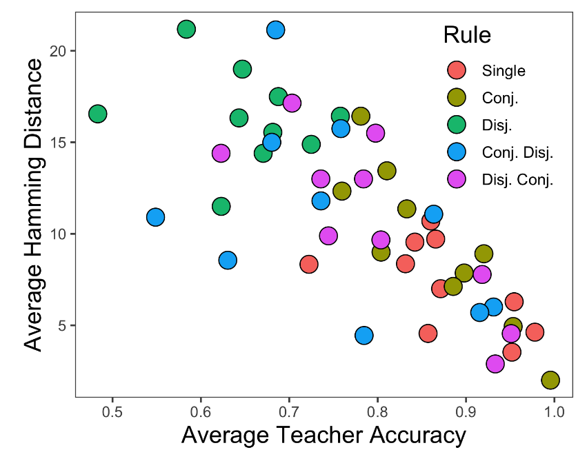
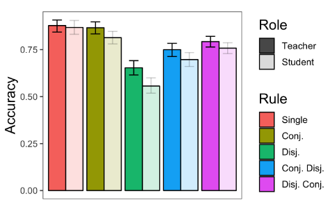

<!-- Replication reports should all use this template to standardize reporting across projects.  These reports will be public supplementary materials that accompany the summary report(s) of the aggregate results. -->

## Introduction

I will replicate Chopra et al., *The First Crank of the Cultural Ratchet*. This is an important study on how language enables the kind of teaching that leads to cultural learning over generations. The study involves pairs of participants. One participant, the "teacher," is asked to learn a category and teach it to someone else. The second participant is the "learner" and is asked to learn the category from the teacher's explanation. Both participants take a test of their understanding and the difference between student and teacher accuracy is analyzed.

Project repository (on Github): [https://github.com/psych251/chopra2019](https://github.com/psych251/chopra2019)

Original paper (as hosted in your repo): [https://github.com/psych251/chopra2019/blob/master/original_paper/0060.pdf](https://github.com/psych251/chopra2019/blob/master/original_paper/0060.pdf)

## Methods

### Power Analysis

I ran a power analysis to find the number of participants I would need to 
recruit in order to achieve 95% power in measuring a correlation between teacher
accuracy and student-teacher Hamming distance. The correlation coefficient reported
in the original paper was -0.75, but I chose a more conservative estimate of -0.5
for the power analysis. To achieve 95% power with an alpha value of 0.05, I would
need a total of 38 observations according to G*Power's correlation power analysis.
My experiment yields five observations (one for each rule learned and communicated) per pair of participants, meaning I would need 14 participants. However, repeated observations from the same student-teacher pair will not be independent, which could mean I need a larger 
sample size. I am not sure how specifically to account for this, so be safe I decided to double the sample size. I also rounded up to 30 because there will likely be a few
exclusions.

### Planned Sample

I plan to run 30 participants as the power analysis I described above suggests
that this should be sufficient to achieve 95% power.

### Materials

"Participants learned concepts generated by 5 different rules (i.e. logical forms): Single Feature, Conjunction, Disjunction, Conjunctive Disjunction, and Disjunctive Conjunction. Rules were realized in specific concepts by varying Boolean properties of programatically generated images of creatures, from five different kinds: flowers, bugs, birds, fish, and trees (see Figure 1 for an example). Each kind had 5 to 7 Boolean features that we used to realize our concepts. Each of the 5 rules was realized twice in each creature kind, yielding a total of 50 concepts (listed on the axis of Figure 3). For each concept, we generated 100 specific creatures, split into 50 for training and 50 for testing. We ensured some positive examples of the concept even for very restrictive rules by first randomly selecting 6 positive instances of the concept and then adding 44 items chosen at random from all remaining items (i.e., according to the true concept base rate)."

The materials in the replication will precisely follow these materials.

### Procedure	

"Every pair of participants was placed in a game, where one was assigned the role of the “teacher” (initial learner) and the other was assigned the role of the “student” (secondary learner). Each game consisted of 5 rounds, each with a new concept from a new rule. Each of a game’s 5 concepts used a different creature kind, and each concept was presented with a different nonce word as the species name. The ordering of concepts was randomized so that there was no standard ordering of rule types across the games. On each round, participants went through three phases: concept learning, concept communicating, and concept testing (Figure 1). During the concept learning phase, the teacher was presented a grid of training creatures and was instructed to click on individual creatures to reveal whether or not they belonged to the species defined by the concept. Once the teacher clicked on every creature in the grid, they were presented a message advising them to review the creatures for as long as they needed. When the teacher ended the concept learning phase, they proceeded to the concept communicating phase, where they entered an online chatroom and were were instructed to teach the concept to the student. Participants were provided no additional instructions for the chatroom, and they were allowed to talk freely. In order to prevent a teacher from rushing through the chatroom without properly communicating with their student, only the student was given the ability proceed to the final concept testing phase. In the final phase both participants were (separately) given the same grid of test creatures and asked to tag the creatures that they believed belonged to the species. Neither participant had access to their chatroom messages during this phase. Once both participants completed concept testing for a concept, they were provided feedback in the form of their own and their partner’s score, computed as: # of hits − \# of false alarms. We encouraged them to learn concepts thoroughly and communicate effectively with a monetary bonus equal to the sum of both players’ scores (in cents). Participants were made aware of the task structure and bonus mechanic prior to starting the first round; they had to answer 5 comprehension questions correctly to begin to the game."

I will precisely follow the same procedure in my replication.

### Analysis Plan

In the original paper, "[p]articipants were restricted to those with U.S. IP addresses and at least a 95% work approval rating; in addition, participants who self-reported a native language other than English or failed to partake in the experiment (accepted the hit but then discussed matters entirely unrelated to the experiment) were excluded." 

I will apply the same exclusion criteria to participant data as is described above,
with the exception that I will also allow users with IP addresses in the United Kingdom. I am doing this because Prolific has a large user base in the UK and it is important to attract participants quickly so that they do not sit in the waiting room for an inordinate amount
of time.

After applying the exclusion criteria, I will compute three metrics of interest for each trial: the teacher's accuracy, the student's accuracy, and the Hamming distance between teacher and student answers. Hamming distance is simply the number of choices that were different between student and teacher.

The key analysis of interest for this project is measuring the Pearson correlation between a teacher's concept accuracy and the Hamming distance between the teacher and student's predictions. The results from the original paper found a strong negative correlation, indicating that teachers who understand the concept well are also good at accurately conveying their knowledge of the concept to students.

I also plan on replicating additional analyses from the original paper. I will analyze the Pearson correlation between student and teacher accuracies and make a bar plot of
the mean student and teach accuracy for each rule type.

### Differences from Original Study

While the original paper collected data on Amazon Mechanical Turk, I will use Prolific due to recent data quality problems on MTurk. I will include users from the United Kingdom
to compensate for the smaller user base on Prolific. Otherwise, I will follow the same methods for running the experiment and analyzing the data. I do not expect this to make a difference to the findings since the task is fundamentally the same and the original effects reported were very strong.

### Methods Addendum (Post Data Collection)

You can comment this section out prior to final report with data collection.

#### Actual Sample
  Sample size, demographics, data exclusions based on rules spelled out in analysis plan

#### Differences from pre-data collection methods plan
  I had difficulty attracting participants quickly enough to pair them together
  in a timely way, so I expanded the geographic range of the sample to include
  the United Kingdom, while the original study only used users in the United 
  States.


## Results

Link to paradigm: https://cultural-ratchet.herokuapp.com/mp-game-6/forms/consent.html


### Data preparation

My data will be in JSON format as I am saving participant actions to a MongoDB database. I will first write a Python script that converts this data to a CSV file which R can parse more easily.

First, I will exclude data from participants whose I.P. addresses were from outside the US, self-reported a first language other than English, or did not make any statements in the chat that were relevant to the task at hand.

I will then use the data to compute the three dependent variables of interest: student accuracy, teacher accuracy, and student-teacher Hamming distance. Accuracies are defined as the proportion of test cases correctly categorized and student-teacher Hamming distance is defined as the number of examples that the student and teacher categorized differently. These variables will be labelled by concept to enable me to aggregate accuracies for each concept and rule type.
	
Here is the link to my [python script](https://github.com/psych251/chopra2019/blob/master/replication_analysis/preprocess.py) that preprocesses the pilot data
and here is the link to the [raw data](https://github.com/psych251/chopra2019/blob/master/replication_analysis/raw_data/pilot_b.json).
	
```{r include=T}
###Data Preparation

# I did this in Python because it handles JSON better.

# function for converting rule indices to types
label_rule = function(rule_idx) {
  if (rule_idx < 10) {
    return("SINGLE_FEATURE")
  } else if (rule_idx < 20) {
    return("CONJUNCTION")
  } else if (rule_idx < 30) {
    return("DISJUNCTION")
  } else if (rule_idx < 40) {
    return("CONJUNCTION_DISJUNCTION")
  } else {
    return("DISJUNCTION_CONJUNCTION")
  }
}

rule_types <- c("SINGLE_FEATURE", "CONJUNCTION", "DISJUNCTION",
                "CONJUNCTION_DISJUNCTION", "DISJUNCTION_CONJUNCTION")

##Load Relevant Libraries and Functions
library(tidyverse)

####Import data
df_scores <- read.csv("../replication_analysis/processed_data/pilotB/scores.csv")
df_tests <- read.csv("../replication_analysis/processed_data/pilotB/tests.csv")

#### Data exclusion / filtering
# this would contain games I have manually identified as full of nonsensical conversations
games_to_exclude <- c() 

df_scores <- df_scores |>
  filter(!game_id %in% games_to_exclude)

df_tests <- df_tests |>
  filter(!game_id %in% games_to_exclude)

#### Prepare data for analysis - create columns etc.

# split explorer and student test data
explorer_tests <- df_tests |>
  filter(role == "explorer") |>
  select(game_id, role, round_num, predicted_label, rule_idx, stim_num, true_label)
colnames(explorer_tests)[4] = "explorer_pred_label"

student_tests <- df_tests |>
  filter(role == "student") |>
  select(game_id, role, round_num, predicted_label, rule_idx, stim_num)
colnames(student_tests)[4] = "student_pred_label"

combined_tests <- explorer_tests |>
  inner_join(student_tests, by=c("game_id", "round_num", "rule_idx", "stim_num")) |>
  rowwise() |>
  mutate(agree = if(student_pred_label == explorer_pred_label) 0 else 1,
         exp_correct = if(explorer_pred_label == true_label) 1 else 0,
         stud_correct = if(student_pred_label == true_label) 1 else 0,
         rule_type = factor(label_rule(rule_idx), levels=rule_types))

# compute accuracies and Hamming distances
hamming_distances <- combined_tests |>
  group_by(game_id, round_num, rule_type) |>
  summarize(explorer_student = sum(agree),
            explorer_accuracy = sum(exp_correct) / n(),
            student_accuracy = sum(stud_correct) / n(), .groups="keep")
```

### Confirmatory analysis

The main test I will run is measuring the Pearson correlation between teacher accuracy and student-teacher Hamming distance. The original paper found a significant negative correlation, which indicates that teachers with more accurate understandings of the concept also conveyed their understanding to students with higher fidelity.

Here is the code I used to compute this in Pilot B:

```{r include=T}
# scatter plot of explorer accuracy and student-teacher Hamming distance
ggplot(hamming_distances, aes(x=explorer_accuracy, y=explorer_student, color=rule_type, group=1)) +
  geom_point(size=3) +
  geom_smooth(method="lm", color="black") +
  labs(x="Explorer Accuracy", y="Explorer-Student Hamming Distance",
       color="Rule Type") +
  theme_minimal()

ggsave("hamming_distance_corr_plot.png", bg="white")

ggplot(hamming_distances, aes(x=explorer_accuracy, y=student_accuracy,
                              color=rule_type, group=1)) +
  geom_point(size=3) +
  geom_smooth(method="lm", color="black") +
  labs(x="Explorer Accuracy", y="Student Accuracy", color="Rule Type") +
  theme_minimal()

ggsave("accuracy_corr_plot.png", bg="white")

# bar plot of student and teacher accuracy for each rule type
hamming_distances |>
  pivot_longer(c("explorer_accuracy", "student_accuracy"), names_to="role",
               values_to="accuracy") |>
  rowwise() |>
  mutate(role = if(role == "student_accuracy") "student" else "explorer") |>
  group_by(role, rule_type) |>
  summarize(mean_acc = mean(accuracy),
            ci_acc = sd(accuracy) / sqrt(n()), .groups="keep") |>
  ggplot(aes(x=rule_type, y=mean_acc, color=role, fill=role), height=7, width=14) +
  geom_bar(stat="identity", position=position_dodge()) +
  geom_errorbar(aes(ymin = mean_acc - ci_acc/2, ymax = mean_acc + ci_acc/2),
                position=position_dodge(0.9), color="black", width=0) +
  labs(x="Rule Type", y="Mean Accuracy") +
  theme_minimal()

ggsave("explorer_student_accuracy.png", height=7, width=14, bg="white")

# correlation between explorer accuracy and explorer-student hamming distance
cor.test(hamming_distances$explorer_student, hamming_distances$explorer_accuracy,
         method="pearson")

# correlation between explorer accuracy and student accuracy
cor.test(hamming_distances$student_accuracy, hamming_distances$explorer_accuracy,
         method="pearson")

# test the differences between student and teacher accuracies for each condition
# and overall
for (rtype in rule_types) {
  df_type <- hamming_distances |>
    filter(rule_type == rtype)
  print(rtype)
  print(t.test(df_type$explorer_accuracy, df_type$student_accuracy))
}

# student vs. teacher across all rules
print(t.test(hamming_distances$explorer_accuracy, hamming_distances$student_accuracy))
```




## Discussion

### Summary of Replication Attempt

Open the discussion section with a paragraph summarizing the primary result from the confirmatory analysis and the assessment of whether it replicated, partially replicated, or failed to replicate the original result.  

### Commentary

Add open-ended commentary (if any) reflecting (a) insights from follow-up exploratory analysis, (b) assessment of the meaning of the replication (or not) - e.g., for a failure to replicate, are the differences between original and present study ones that definitely, plausibly, or are unlikely to have been moderators of the result, and (c) discussion of any objections or challenges raised by the current and original authors about the replication attempt.  None of these need to be long.
