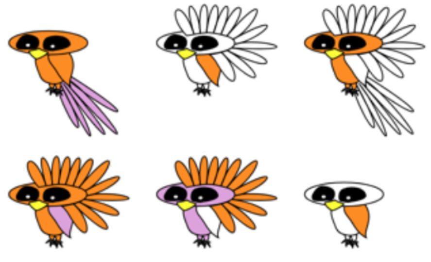

<!-- Reproducibility reports should all use this template to standardize reporting across projects. These reports will be public supplementary materials that accompany the summary report(s) of the aggregate results. -->

## Introduction

I will replicate Chopra et al., *The First Crank of the Cultural Ratchet*. This is an important study on how language enables the kind of teaching that leads to cultural learning over generations. The study involves pairs of participants. One participant, the "teacher," is asked to learn a category and teach it to someone else. The second participant is the "learner" and is asked to learn the category from the teacher's explanation. Both participants take a test of their understanding and the difference between student and teacher accuracy is analyzed.

### Justification for choice of study

A major component of my research involves studying how language enables teaching and cultural learning. I plan to extend upon this paper in my research by trying different tasks, such as understanding the behaviour of a dynamical system, in a cultural ratchet context. Replicating the results of this paper is a good first step before eventually extending it.

### Anticipated challenges

The experiment I am replicating involves a category learning task in which participants are shown different "critters" with features like feathers on their head and wings. They are asked to learn which critters belong to a nonsense category, like "feps," based on examples of feps and non-feps. Next, participants are paired up with another participant and asked to explain the category they just learned to their partner. This happens via text chat. Both participants are then shown critters and asked if they are feps or not. The teacher and learner accuracies are then analyzed.

Here are some example critters:


The main challenge I anticipate is getting the experiment to run properly. While the code for the original experiment is publically available, it is several years old and crashes when I try to run it locally. I think this is due to changes in some of the modules that the code depends on. I will need to debug the experiment code to get it working properly. I have not tried to run the analysis code yet, but I might have a similar problem with that. Finally, the original study was run on MTurk while I will run the replication on Prolific. I think this is the best option since the quality of data from MTurk has declined recently, but it is possible that differences between the platforms will lead to somewhat different results.

### Links

Project repository (on Github): [https://github.com/psych251/chopra2019](https://github.com/psych251/chopra2019)

Original paper (as hosted in your repo): [https://github.com/psych251/chopra2019/original_paper/0060.pdf](https://github.com/psych251/chopra2019/original_paper/0060.pdf)

## Methods

### Description of the steps required to reproduce the results

Please describe all the steps necessary to reproduce the key result(s) of this study. 

### Differences from original study

Explicitly describe known differences in the analysis pipeline between the original paper and yours (e.g., computing environment). The goal, of course, is to minimize those differences, but differences may occur. Also, note whether such differences are anticipated to influence your ability to reproduce the original results.

## Project Progress Check 1

### Measure of success

Please describe the outcome measure for the success or failure of your reproduction and how this outcome will be computed.


### Pipeline progress

Earlier in this report, you described the steps necessary to reproduce the key result(s) of this study. Please describe your progress on each of these steps (e.g., data preprocessing, model fitting, model evaluation).


## Results

### Data preparation

Data preparation following the analysis plan.
	
```{r include=F}
### Data Preparation

#### Load Relevant Libraries and Functions

#### Import data

#### Data exclusion / filtering

#### Prepare data for analysis - create columns etc.
```

### Key analysis

The analyses as specified in the analysis plan.  

*Side-by-side graph with original graph is ideal here*

###Exploratory analyses

Any follow-up analyses desired (not required).  

## Discussion

### Summary of Reproduction Attempt

Open the discussion section with a paragraph summarizing the primary result from the key analysis and assess whether you successfully reproduced it, partially reproduced it, or failed to reproduce it.  

### Commentary

Add open-ended commentary (if any) reflecting (a) insights from follow-up exploratory analysis of the dataset, (b) assessment of the meaning of the successful or unsuccessful reproducibility attempt - e.g., for a failure to reproduce the original findings, are the differences between original and present analyses ones that definitely, plausibly, or are unlikely to have been moderators of the result, and (c) discussion of any objections or challenges raised by the current and original authors about the reproducibility attempt (if you contacted them).  None of these need to be long.
